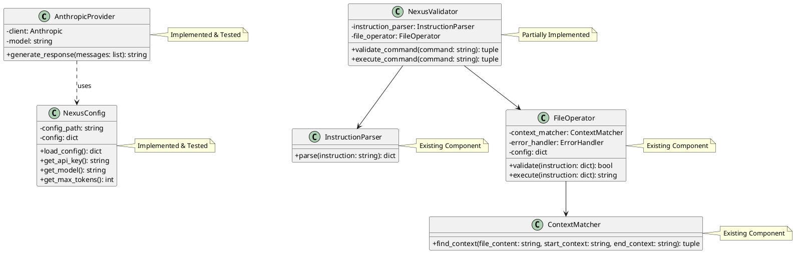

# LLM Interface Project: Class Diagram

This class diagram shows the main components of the LLM interface project, their relationships, and their implementation status. The AnthropicProvider and NexusConfig classes are fully implemented and tested, while the NexusValidator is partially implemented. The InstructionParser, FileOperator, and ContextMatcher are existing components from the main project that are utilized in the LLM interface.