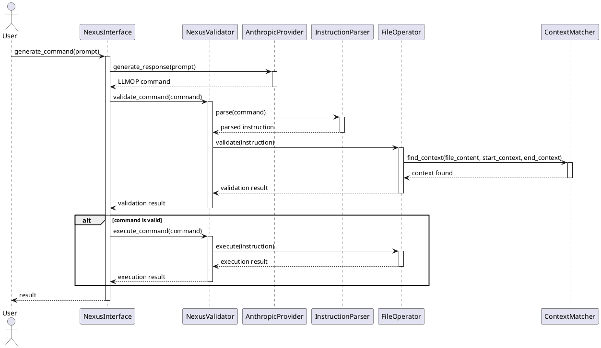

# LLM Interface Project: Sequence Diagram

This sequence diagram illustrates the flow of operations in the LLM interface project, from the user's initial prompt to the execution of the generated LLMOP command. It shows the interactions between various components, including those that are fully implemented (AnthropicProvider) and those that are part of the existing system (InstructionParser, FileOperator, ContextMatcher).